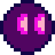
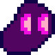
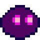
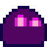
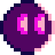

# Blob-Blob
Blob-Blob (the best name I could think of in 5min) is my first attempt at a Godot 2D Platformer.

# Scope of the Game
Blob-Blob will not be overly complex and will have the bog-standard elements of a platformer with additional features I see fit as I develop it.

The currently planned MVP features include:
- [X] Visual Art + Animations
  - [X] Sprites for player in various states
  - [X] Basic tiles and platforms
  - [X] Enemy sprites
  - [X] A logo (plus other menu related items)
- [X] Basic 2D Movement
  - [X] Walking (or sliding) left and right
  - [X] Jumping
- [X] Interactions with Game Environment
  - [X] One-way platforms
  - [X] A means of attack and getting damaged
- [ ] Enemies
  - [X] Basic Movement
  - [X] Drop item(s) on death
    - [X] Pick Up for level completion
    - [ ] Health Pickup for player
- [ ] At least 3-5 different stages/levels 

# Credits
Scripting, most visual art and overall design and development by [me](https://github.com/Josh-SCG)

Parallax Background remixed from [A platformer in the forest by Buch](https://opengameart.org/content/a-platformer-in-the-forest)

Title screen music from [Menu Music by mrpoly](https://opengameart.org/content/menu-music)

Level music from [Loading screen loop by Brandon Morris (aka HaelDB)](https://opengameart.org/content/menu-music)

# Some of the animations I made :D
     
